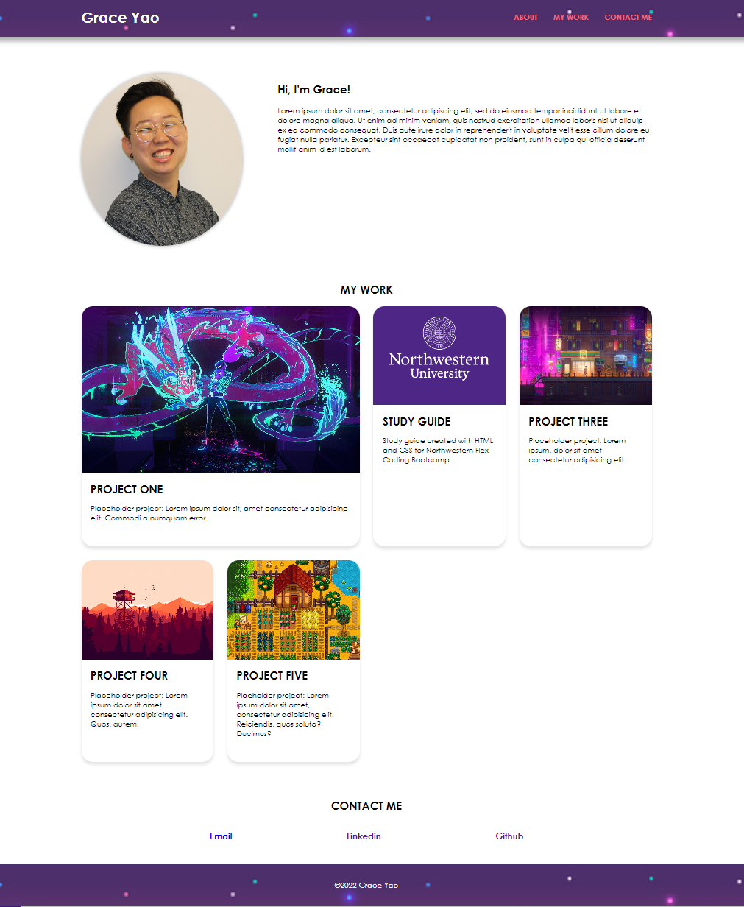

# Portfolio Website

## Description

The primary goal of this project is to apply HTML and CSS skills learned in the previous modules in order to create a web application from scratch. The secondary goal is to create a portfolio page to showcase skills and talents to employers which I can continue to use and add to as the course progresses. 

I have utilized flexbox, grid, media queries, CSS variables, pseudoelements and basic animations to create a functional, as well as aesthetically interesting, portfolio webpage.  

## Installation

You can open the webpage in your web browser using this URL: https://gyao1487.github.io/portfolio/

## Usage
Features implemented on this webpage:
* Clicking the links in the navigation bar at the top will take you to the respective sections on the webpage
* In the work section, animations are applied when hovering the cursor over the different applications.
* Clicking the cards in the work section will redirect you to the deployed applications.
* Layout is responsive and will adapt to the viewport at various screen sizes to optimize readability and aesthetic.

## Credits
Referenced resources from the following websites to complete this project:
* https://www.w3schools.com/css
* https://www.w3schools.com/html
* https://chenhuijing.com/blog/the-horizontal-overflow-problem/
* https://codepen.io/tutsplus/pen/YGQKry

Placeholder images used:
* https://i.pinimg.com/564x/77/34/c5/7734c51a3bbcdf66d78d9763dbde2a6c.jpg
* https://www.northwestern.edu/brand/images/wordmark/guideline-sm4.gif
* https://images.squarespace-cdn.com/content/v1/57bdc26ee6f2e14fa305ef54/1477329662508-ARF2ZQSDBWHPAJXOND86/image-asset.jpeg
* https://media.istockphoto.com/vectors/pixel-art-cyberpunk-metropolis-background-vector-id1279840008?k=20&m=1279840008&s=170667a&w=0&h=-iGUKiZEL2WRbhNLL6N5kEb0aR8BRHHGY8pODdiRTow=
* https://pbs.twimg.com/media/Eou5TLPU8AAVr6G?format=jpg&name=large

## License
Please refer to the LICENSE in the repo.
